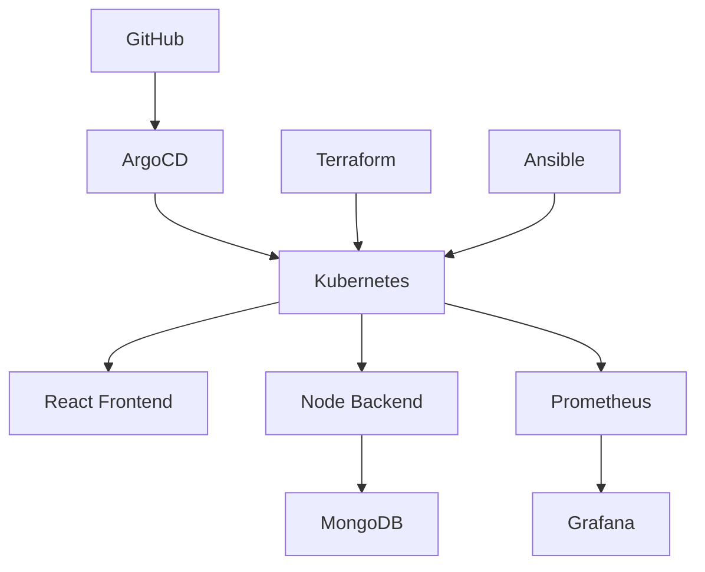

# Production Kubernetes Platform with GitOps & Observability

A production-style cloud-native platform that demonstrates modern DevOps, Platform Engineering, and Site Reliability Engineering (SRE) practices.

This project combines Infrastructure as Code (Terraform), Configuration Management (Ansible), GitOps Delivery (ArgoCD), Container Orchestration (Kubernetes), and Observability (Prometheus & Grafana) into a single end-to-end platform.

## Architecture

## Screenshots
### Grafana Dashboard


### ArgoCD Application Status


### Kubernetes Workloads


## Reliability & Observability

This platform includes:

- Prometheus metrics collection
- Grafana dashboards and visualization
- Kubernetes health monitoring
- Service-level observability
- Alerting workflows
- Production-style troubleshooting practices

## Key Capabilities

- Infrastructure as Code (Terraform)
- Configuration Management (Ansible)
- GitOps Continuous Delivery (ArgoCD)
- Kubernetes Workload Orchestration
- Monitoring & Observability (Prometheus + Grafana)
- Dockerized Application Deployment
- Full-Stack Application Validation (Node.js + React + MongoDB)

## Technology Stack
Terraform | Ansible | Kubernetes | Docker | ArgoCD | Prometheus | Grafana | Node.js | React | MongoDB


## Project Guide

Detailed implementation and operation notes have moved to:

```text
docs/project_guide.md
```

The guide includes local run instructions, backend metrics, Prometheus/Grafana, Kubernetes deployment, Ingress, CI/CD, Docker publishing, Kustomize, Argo CD, runbook notes, Terraform, and project progress.
